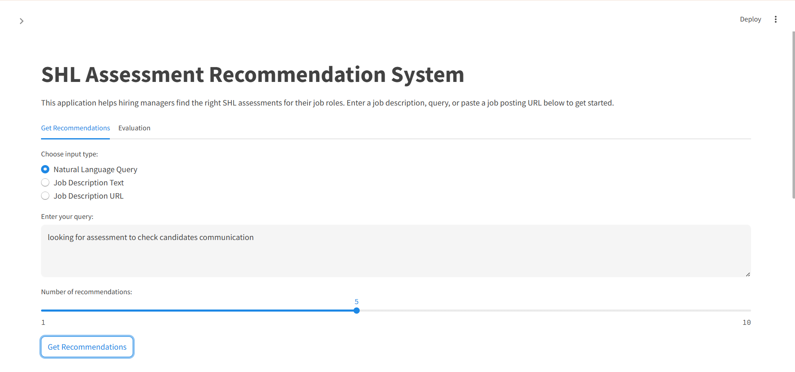

# SHL-Recommender
This project helps HR professionals find relevant SHL assessments based on job descriptions or query text. It uses NLP and recommendation algorithms to suggest the most suitable assessments.

Subject: Apology Regarding Deployment URLs Submission

Respected SHL Team,

I sincerely apologize for not being able to provide the hosted demo and API endpoint URLs as requested in the submission guidelines. Due to technical constraints and deployment challenges, I was unable to host the working demo and API online.

However, I have ensured that the complete source code, including the working demo, API logic, and evaluation files, is available and well-documented in the GitHub repository below:

🔗 GitHub Link: https://github.com/Diksha2004/SHL-Recommender.git

You can run the project locally by following the instructions provided in the README. If needed, I would be happy to assist further or demonstrate the functionality live.

Thank you for your understanding, and I appreciate the opportunity.


to run this project
1. **Clone this Repository**
    ```bash
    git clone https://github.com/Diksha2004/SHL-Recommender.git
    cd SHL-Recommender
    ```

2. **Create and Activate Virtual Environment**
    ```bash
    python -m venv venv
    venv\Scripts\activate   # On Windows
    # OR
    source venv/bin/activate   # On macOS/Linux
    ```

3. **Install Required Packages**
    ```bash
    pip install -r requirements.txt
    ```

4. **Run the Streamlit Demo App**
    ```bash
    streamlit run app.py
    ```



